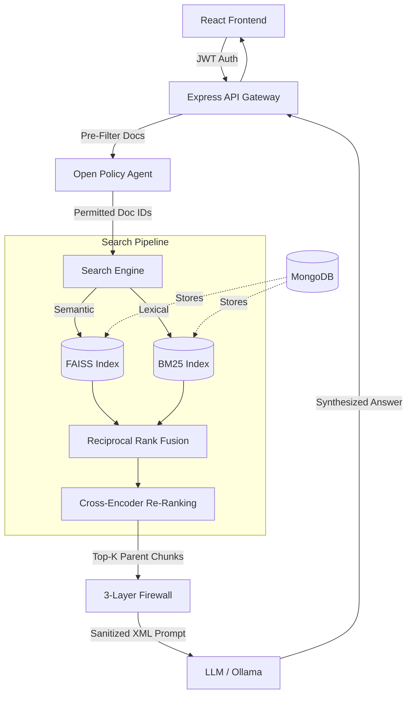
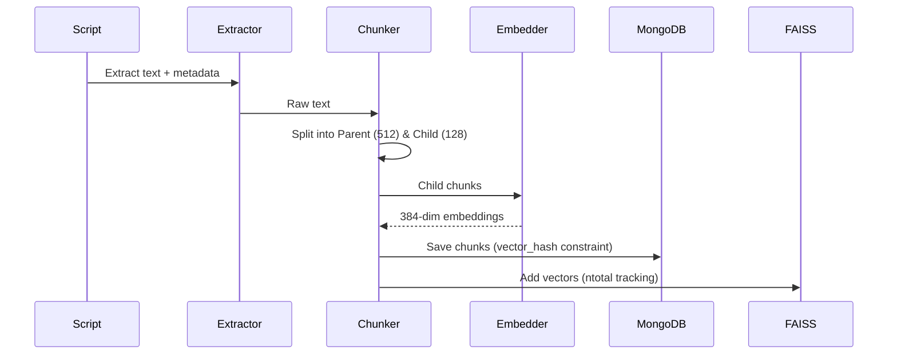

# System Design Document
## Secure Intelligence Platform for NCMM

### 1. Architecture Overview
The platform utilizes a modern RAG (Retrieval-Augmented Generation) pipeline backed by a multi-tiered security and access control mechanism.

### 2. Core Components
- **Frontend**: React application built with Vite. Manages JWTs in-memory (Context API) to prevent XSS exfiltration. Includes Chat interface and Admin Dashboard.
- **Backend API**: Node.js/Express server handling routing, rate limiting (60 req/min), and orchestration of the RAG pipeline.
- **Vector Store & Full-Text Search**:
  - `FAISS (faiss-node)`: Handles L2 distance vector similarity search for `all-MiniLM-L6-v2` embeddings (384-dimensional).
  - `BM25`: In-memory sparse lexical search for keyword precision.
- **Database**: MongoDB handles operational data, parent/child chunks, metadata, and ABAC audit logs with a 90-day TTL index.
- **Policy Engine**: Open Policy Agent (OPA) evaluating modern Rego (`if` syntax) policies for strict Attribute-Based Access Control (ABAC).

### 3. Data Flow & Security Constraints

#### 3.1 Data Ingestion Pipeline

#### 3.2 Multi-Layer Firewall Architecture
- **Layer 1 (L1 Normalizer)**: Applies NFKC Unicode normalization and strips zero-width/bidi characters to prevent obfuscated injections.
- **Layer 2 (L2 Classifier)**: Uses an ONNX intent classifier to heuristically block injection and jailbreak attempts.
- **Layer 3 (L3 XML Vault)**: Isolates system instructions from user input and retrieved context using strictly parsed XML tags.
