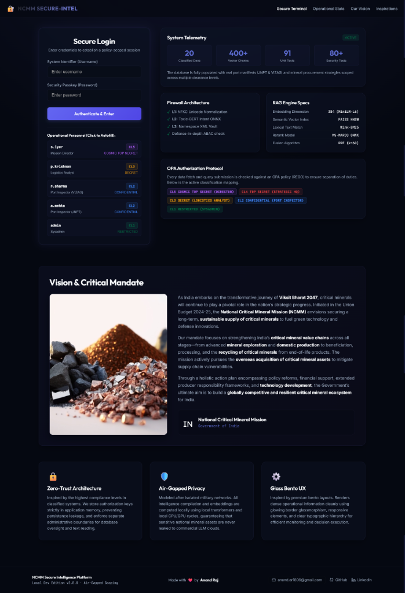
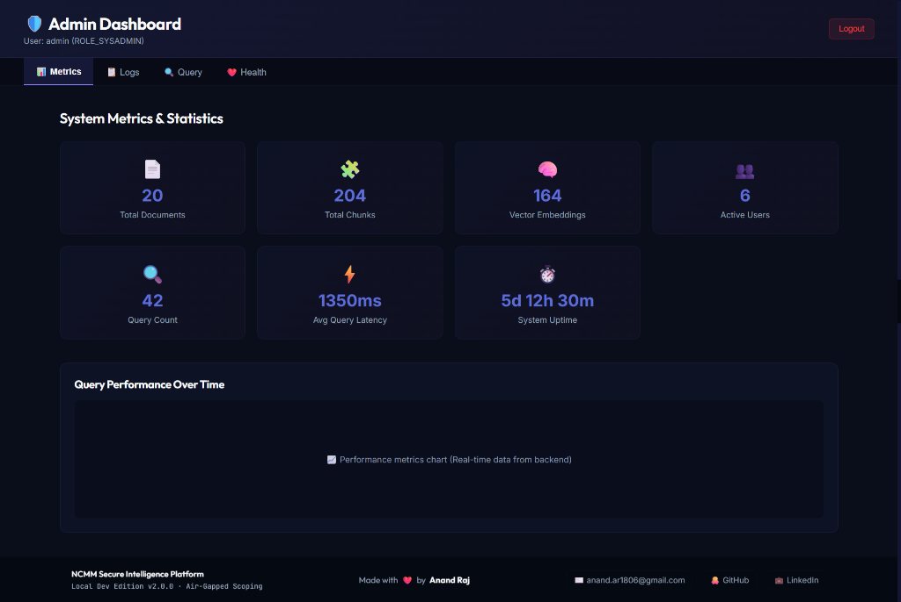
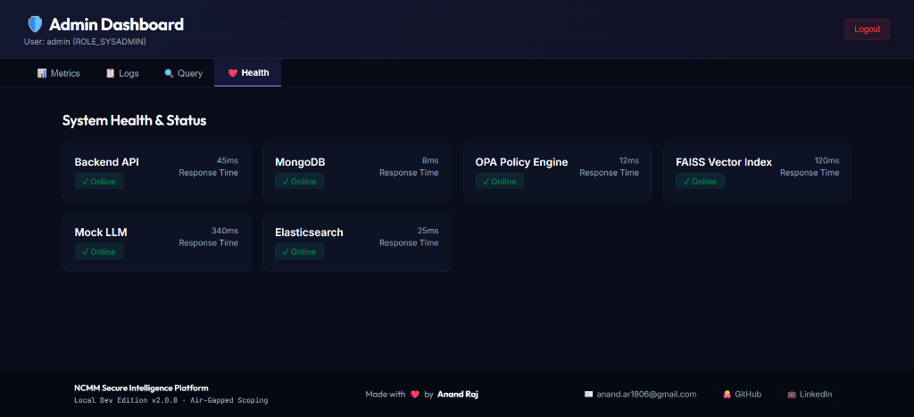
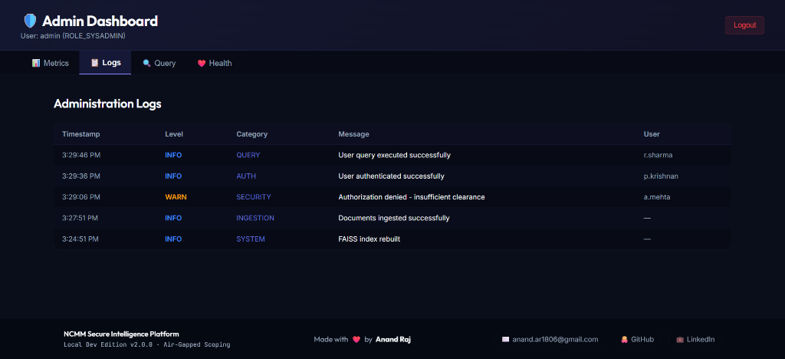
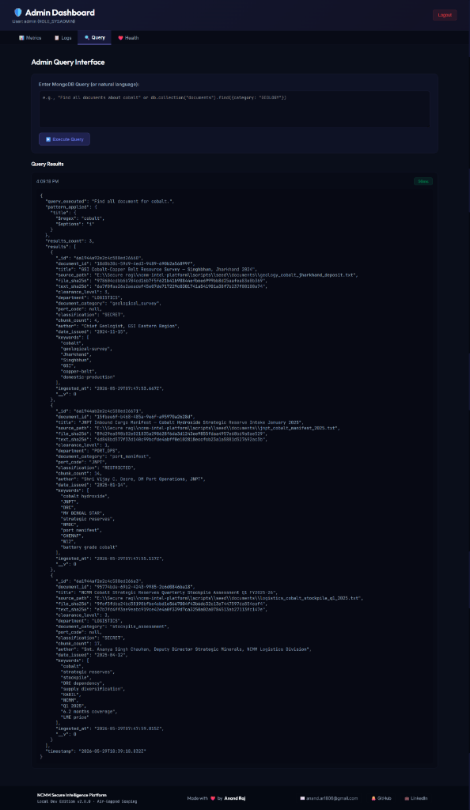

# 🔐 NCMM Secure Intelligence Platform

> National Critical Mineral Mission · Local Developer Edition v2.0.0
> 
> **Hardware**: 8GB RAM / ~4GB available  
> **Classification Levels**: RESTRICTED (1) → COSMIC TOP SECRET (5)

---

## 📸 System Screenshots

### Secure Login & Mandate Vision


### Admin Dashboard - Telemetry & Metrics


### Admin Dashboard - System Health


### Admin Dashboard - Security Logs


### Admin Dashboard - Secure Query Testing


---

## 📚 Core Documentation

This project is built to B.Tech Capstone and enterprise-grade standards. For comprehensive details, please review the dedicated documentation files in the `Docs/` directory:

- 📄 **[Requirements Document](Docs/Requirements.md)**: Details functional requirements, ABAC access controls, and RAG firewall specifications.
- 📐 **[System Design](Docs/Design.md)**: Explains the multi-tiered architecture and includes Mermaid.js sequence diagrams for the ingestion pipeline.
- 📋 **[Agile Task Backlog](Docs/Task.md)**: Tracks completed Epics across Infrastructure, Security, Ingestion, and UI.
- 🐛 **[Debug Session Log](Docs/DEBUG_SESSION.md)**: Documents all bugs, root cause analyses, and architectural solutions implemented during development.
- 📊 **[Test Results (Comprehensive)](Docs/TEST_RESULTS_COMPREHENSIVE.md)** & **[Query Test Results](Docs/QUERY_TEST_RESULTS.md)**: Logs of adversarial testing and retrieval performance.
- ⚙️ **[No-Docker Setup Guide](Docs/SETUP_NO_DOCKER.md)**: Instructions for running the project on machines without Docker Desktop.

---

## 🏗️ Architecture Overview

```
User Query (React) → JWT Auth → OPA Pre-Filter → FAISS (k=50) + BM25 (k=50)
    → RRF Fusion (top-20) → Cross-Encoder (top-5) → Firewall (L1→L2→L3)
    → Mock LLM / Ollama → Response with Citations
```

**Five Security Layers:**
1. **JWT Middleware** — Role-based bearer token validation
2. **OPA ABAC** — Policy engine enforcing clearance + department + port isolation
3. **Firewall L1** — NFKC Unicode normalizer + zero-width / bidi char stripper
4. **Firewall L2** — Heuristic + ONNX intent classifier (injection / jailbreak detection)
5. **Firewall L3** — XML structured prompt vault (system instruction isolation)

---

## 📋 Prerequisites

| Requirement | Version | Check |
|---|---|---|
| Node.js | ≥ 20.0.0 | `node --version` |
| npm | ≥ 9.0.0 | `npm --version` |
| Docker Desktop | Latest | `docker --version` |
| VS Code | Latest | — |

---

## 🚀 Setup — Step by Step (VS Code Terminal)

### Step 1: Install Dependencies

Open VS Code, then open the **Integrated Terminal** (`Ctrl+`` `) and run:

```powershell
# Backend dependencies
cd "e:\Secure rag\ncmm-intel-platform\backend"
npm install

# Frontend dependencies  
cd "e:\Secure rag\ncmm-intel-platform\frontend"
npm install

# Root-level test runner
cd "e:\Secure rag\ncmm-intel-platform"
npm install
```

**Note on heavy packages:**
- `faiss-node` — downloads ~150MB C++ binary (FAISS index)
- `@xenova/transformers` — downloads `all-MiniLM-L6-v2` (~90MB) on first run
- These downloads happen once and are cached

### Step 2: Start Docker Services

```powershell
cd "e:\Secure rag\ncmm-intel-platform"
docker-compose up -d
```

Verifies: MongoDB (port 27017) + OPA (port 8181) are running.

```powershell
# Health check OPA:
Invoke-RestMethod http://127.0.0.1:8181/v1/health
# Expected: { "healthy": true }
```

### Step 3: Initialise Database

```powershell
cd "e:\Secure rag\ncmm-intel-platform"

# Create MongoDB indexes
node scripts/setup/init_db_indexes.js

# Seed 6 ABAC test users
node scripts/seed/seed_abac_policies.js

# Ingest all 20 NCMM seed documents
node scripts/seed/run_seed_ingestion.js
```

**Expected output:** `20 documents, ~400 chunks, ~200 FAISS vectors (384-dim)`

### Step 4: Verify Setup

```powershell
node scripts/dev/check_db_health.js      # MongoDB health
node scripts/dev/verify_faiss_index.js   # FAISS index
```

---

## 🖥️ Running the Platform

### Option A: VS Code Launch Configs (Recommended)

Press **F5** or go to **Run → Start Debugging**.

Available launch configs (`.vscode/launch.json`):
- **Express API Server** — Starts backend on port 3000
- **Mock LLM Server** — Starts Ollama-compatible mock on port 11434  
- **React Dev Server** — Starts frontend on port 5173
- **Full Dev Stack (API + Mock LLM)** — Starts API + Mock LLM together (compound)

### Option B: Terminal Commands

**Terminal 1 — Express API:**
```powershell
cd "e:\Secure rag\ncmm-intel-platform\backend"
node src/server.js
```

**Terminal 2 — Mock LLM:**
```powershell
cd "e:\Secure rag\ncmm-intel-platform\backend"
npm run mock-llm
```

**Terminal 3 — React Frontend:**
```powershell
cd "e:\Secure rag\ncmm-intel-platform\frontend"
npm run dev
```

### Access Points

| Service | URL |
|---|---|
| **React UI** | http://localhost:5173 |
| **Express API** | http://localhost:3000 |
| **API Health** | http://localhost:3000/health |
| **Prometheus Metrics** | http://localhost:3000/metrics |
| **Mock LLM** | http://localhost:11434 |
| **OPA** | http://localhost:8181/v1/health |
| **MongoDB** | mongodb://localhost:27017 |

---

## 🔑 Test Credentials

| Username | Password | Role | Clearance | Port |
|---|---|---|---|---|
| `r.sharma` | `vizag-inspector-pass-2025` | Port Inspector | CL2 | VIZAG |
| `a.mehta` | `jnpt-inspector-pass-2025` | Port Inspector | CL2 | JNPT |
| `p.krishnan` | `logistics-analyst-pass-2025` | Logistics Analyst | CL3 | — |
| `s.iyer` | `mission-director-pass-2025` | Mission Director | CL5 | — |
| `admin` | `sysadmin-pass-2025` | Sysadmin | CL1 | — |

---

## 🧪 Running Tests

### Unit Tests (no services needed)
```powershell
cd "e:\Secure rag\ncmm-intel-platform"
npx jest --testPathPattern="tests/unit" --config=tests/jest.config.js
```

### Adversarial Tests (no services needed)
```powershell
npx jest --testPathPattern="tests/adversarial" --config=tests/jest.config.js
```

### All Tests (requires Docker services running)
```powershell
npx jest --config=tests/jest.config.js
```

### OPA Policy Tests
```powershell
# Requires OPA binary or Docker
docker run --rm -v "e:\Secure rag\ncmm-intel-platform\policies:/policies" openpolicyagent/opa test /policies -v
```

---

## 🔧 Dev Tools

### Generate JWT for any role:
```powershell
cd "e:\Secure rag\ncmm-intel-platform"
node scripts/dev/generate_test_jwt.js --role ROLE_MISSION_DIRECTOR
node scripts/dev/generate_test_jwt.js --role ROLE_PORT_INSPECTOR --port JNPT
```

### Test the API directly with curl:
```powershell
# Get a JWT (from the generate_test_jwt.js output) then:
$TOKEN="eyJ..."  # paste your token here

# Test query
Invoke-RestMethod -Method POST -Uri http://localhost:3000/api/v1/query `
  -Headers @{ Authorization = "Bearer $TOKEN"; "Content-Type" = "application/json" } `
  -Body '{"query":"What is the current lithium carbonate stockpile level?"}'
```

### Clear all test data:
```powershell
$env:NODE_ENV="development"
node scripts/seed/clear_test_data.js
```

---

## 📁 Project Structure

```
ncmm-intel-platform/
├── backend/
│   └── src/
│       ├── server.js              ← Express entry point
│       ├── mock-llm/              ← Mock Ollama server
│       ├── ingestion/             ← Watcher, extractor, chunker, embedder, pipeline
│       ├── search/                ← FAISS, BM25, RRF, CrossEncoder
│       ├── firewall/              ← L1 normalizer, L2 classifier, L3 XML vault
│       ├── middleware/            ← auth.js (JWT), abac.js (OPA)
│       ├── routes/                ← auth.js, query.js, records.js
│       └── telemetry/             ← Prometheus metrics
├── frontend/
│   └── src/
│       ├── App.tsx
│       ├── pages/                 ← LoginPage, ChatPage, ForbiddenPage
│       ├── components/            ← RouteGuard, CitationOverlay
│       └── hooks/                 ← useAuth
├── policies/                      ← OPA Rego policies + tests
├── scripts/
│   ├── setup/                     ← init_db_indexes.js
│   ├── seed/                      ← 20 documents, seed scripts
│   └── dev/                       ← JWT generator, health checks
├── tests/
│   ├── unit/                      ← RRF, chunker, normalizer, JWT, XML vault, citations
│   ├── adversarial/               ← Injection, homoglyph, bidi, jailbreak, ABAC bypass, data leak
│   ├── security/                  ← JWT rejection tests
│   └── fixtures/                  ← JWT fixtures, document fixtures
├── docker-compose.yml             ← MongoDB + OPA
├── docker-compose.monitoring.yml  ← Prometheus + Grafana (optional)
├── .env                           ← Dev environment variables
└── .vscode/                       ← Launch configs, tasks, settings
```

---

## 🛡️ Security Invariants

| Invariant | Enforcement |
|---|---|
| No CL5 data to CL<5 users | OPA pre-filter + cross-encoder secondary ABAC |
| VIZAG inspector sees 0 JNPT citations | OPA port isolation policy |
| Sysadmin denied all documents | OPA explicit deny rule |
| Prompt injection blocked | Firewall L1 (unicode) + L2 (classifier) + L3 (XML vault) |
| JWT in memory only (no localStorage) | React state hook (useAuth.ts) |
| Metrics endpoint localhost only | Express IP check |
| Audit log for every OPA decision | MongoDB audit_logs (TTL: 90 days) |

---

## 🚨 Troubleshooting

| Problem | Fix |
|---|---|
| `MongoDB connection failed` | Run `docker-compose up -d`, wait 10s |
| `OPA timeout` | Check `docker ps` — OPA container must be running |
| `LLM unavailable` | Start mock-llm: `npm run mock-llm` in backend dir |
| `FAISS index not found` | Run `node scripts/seed/run_seed_ingestion.js` |
| `faiss-node install fails` | Requires Visual C++ Build Tools. Install from: https://visualstudio.microsoft.com/visual-cpp-build-tools/ |
| `@xenova/transformers slow first run` | Normal — downloading ~90MB model. Wait 2-3 min. |
| `BM25 empty results` | Restart server after ingestion — BM25 rebuilds on startup |
